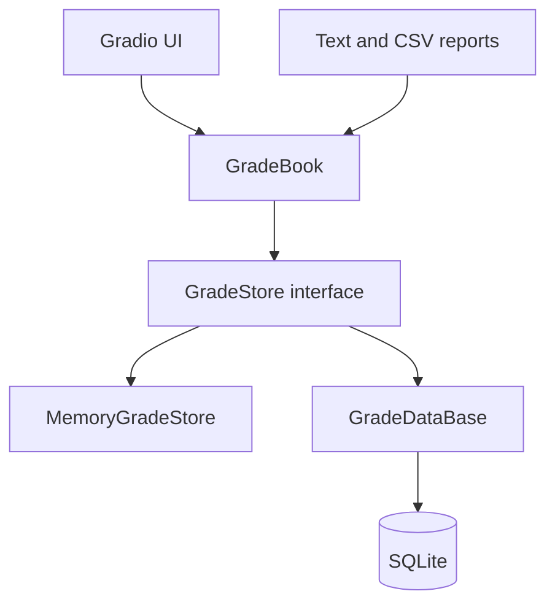

# Grade Tracker

Grade Tracker is a Python learning project for managing students, courses,
enrollments and grades. It combines a Gradio dashboard with a storage abstraction
that supports both in-memory data and persistent SQLite storage.

The project focuses on object-oriented design, clear responsibilities, validation,
dependency inversion through a store interface, automated tests and a practical UI.

> **Project status:** Active development. The current Gradio application is version
> `v0.785` and already covers the main workflows for students, courses and grades.

## Current features

### Students

- Add, search, edit and delete students
- Validate student data and report duplicate or missing records
- Show each student's average grade
- Enroll students in courses
- Display a student's enrolled courses
- Generate an individual student report

### Courses

- Add, search, edit and delete courses
- Store the term directly on the course
- Configure maximum and passing scores per course
- Protect course updates when existing grades would become invalid
- Display course averages and pass rates
- Show the students enrolled in a course
- Generate a course statistics report

### Grades

- Record, edit and delete grades
- Store a date and optional notes with each grade
- Calculate percentages, letter grades and pass/fail status
- Validate scores against the selected course's maximum score
- Import grades from CSV

### Dashboard and reports

- Overview counters for students, courses and grades
- Top-five student ranking
- Identification of students at risk (average below 60%)
- Grade-distribution chart
- Chart of the five courses with the most recorded grades
- Summary, student and course reports
- Text preview and downloadable TXT or CSV output
- Optional demo data, loaded manually from the dashboard

## Domain model

The central domain objects are Python dataclasses:

- `Student` represents a student and owns student-specific validation.
- `Course` represents a concrete course in a particular term, including its maximum
  and passing scores.
- `Grade` connects a student and course with a score, date and optional notes. It
  derives the percentage, letter grade and passing status.
- `Enrollment` represents the assignment of a student to a course.

`GradeBook` is the application facade. It coordinates the main use cases and contains
statistics, search and cross-object rules, while persistence is delegated to a store.

## Architecture



The layers have distinct responsibilities:

| Layer | Responsibility |
| --- | --- |
| Gradio UI | Displays data, collects input and connects events to handlers |
| `GradeBook` | Coordinates use cases, searches, statistics and domain rules |
| `GradeStore` | Defines the persistence operations required by the application |
| `MemoryGradeStore` | Provides fast, non-persistent storage, especially for tests |
| `GradeDataBase` | Implements persistent storage with SQLite and parameterized SQL |
| Report generators | Produce summary, student and course reports in text or CSV format |

The UI depends on `GradeBook`, and `GradeBook` depends on the `GradeStore` abstraction.
This allows the same application logic to run with either storage implementation.

## Project structure

```text
grade_tracker/
├── app_new.py                  # Gradio application and UI event handlers
├── gradebook_new.py            # Application facade and statistics
├── exceptions.py               # Domain-specific exceptions
├── persistence.py              # Import and serialization helpers
├── grades_new.db               # SQLite database, created at runtime
│
├── grade_management/
│   ├── student.py              # Student dataclass
│   ├── course.py               # Course dataclass
│   ├── grade.py                # Grade dataclass and derived properties
│   └── enrollment.py           # Student-course enrollment
│
├── storage/
│   ├── base.py                 # GradeStore abstract interface
│   ├── memory_store.py         # In-memory implementation
│   └── sqlite_store.py         # SQLite implementation (GradeDataBase)
│
├── reports/
│   ├── text_report.py          # Plain-text report generator
│   └── csv_report.py           # CSV report generator
│
├── images/
│   └── logo.png                # Application logo
│
└── tests/                      # pytest test suite
```

The `_new` suffix reflects the current development filenames and can be removed once
the ongoing refactoring has been completed.

## Requirements

- Python 3.13
- Gradio
- Matplotlib
- pytest (development and tests)
- SQLite, `dataclasses`, `csv`, `pathlib`, `re`, `tempfile` and `threading` from the
  Python standard library

## Installation

Create and activate a virtual environment:

```bash
python3 -m venv .venv
source .venv/bin/activate
```

Install the external dependencies:

```bash
python -m pip install gradio matplotlib pytest
```

## Running the application

Start the current Gradio application:

```bash
python app_new.py
```

Then open [http://127.0.0.1:7860](http://127.0.0.1:7860) in a browser.

The application creates or opens `grades_new.db` next to `app_new.py`. Data remains
available after a restart. For isolated tests or experiments, the storage path can be
changed to `:memory:`.

Demo data is **not** inserted automatically. When the database is empty, use the
**Load Demo Data** button on the dashboard.

## CSV grade import

The grade import expects the following column order:

```text
student_id,course_id,score,date,notes
```

The `notes` column is optional. Example:

```csv
s1,c1,92,2026-01-15,Final exam
s2,c1,78,2026-01-15
```

Referenced students and courses must already exist, and the score must be valid for
the selected course.

## Running the tests

Run the test suite from the project root:

```bash
pytest
```

The tests exercise domain validation, the shared store contract and CRUD behavior.
Both the in-memory and SQLite implementations are intended to satisfy the same store
expectations.

## Design decisions

- **Course terms belong to `Course`:** a course represents a concrete offering in a
  particular term rather than a timeless course definition.
- **Persistence is replaceable:** `GradeBook` receives a store instead of containing
  SQLite code.
- **Statistics stay in the application layer:** averages, pass rates, rankings and
  risk detection are calculated by `GradeBook` using data supplied by the store.
- **Reports use separate generators:** text and CSV output can evolve independently
  from the Gradio interface.
- **IDs remain stable during edits:** student, course and grade updates change their
  editable data without replacing their identities.

## Current development priorities

- Split `app_new.py` into smaller UI modules and replace the large `full_refresh()`
  output list with focused refresh functions
- Align the store interface, both implementations and the test suite after the recent
  enrollment and CRUD changes
- Complete the enrollment lifecycle, including removing enrollments and persistence
  tests
- Add long-term student performance tracking and statistics grouped by term
- Introduce a credit or point system for courses and completed studies
- Add automatic ID generation and expand input validation
- Rename the current `*_new.py` modules after the refactoring is stable

## Learning goals

This repository is intentionally developed in small steps. Its main purpose is to
practice translating domain rules into cohesive classes and interfaces, applying
GRASP principles such as Information Expert, High Cohesion and Low Coupling, and using
patterns only where they solve a concrete design problem.
